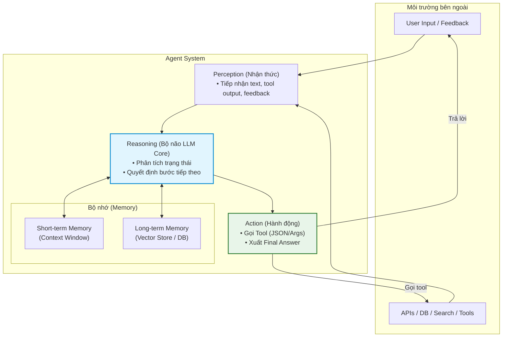
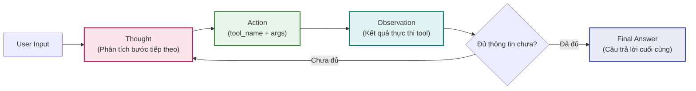

# 2026-09-12 — VinUni - Buổi 3

# Sáng
## Main thread of today

* **Trọng tâm:** Thiết kế Workflow và Cơ chế Kiểm soát Hệ thống AI (Khóa AI Thực chiến VinUni K4A).
* **Chi tiết kiến thức đã hệ thống:** [[Day 03 - Thiết kế Workflow và Kiểm soát Hệ thống AI]]

---

## What did I learn today?

* **Khám phá vấn đề HCD:** Chuyển từ yêu cầu giải pháp sang bài toán người dùng; đưa feedback đúng bước trong vòng lặp HCD.
* **Lựa chọn & Định lượng Workflow:** Lập bản đồ Current State và Future State; xác định duy nhất một nút thắt (bottleneck) có bằng chứng; phân định rõ Rule vs AI vs Con người.
* **Độ phù hợp AI & Trách nhiệm:** Phân định rõ việc LLM làm trực tiếp (ngôn ngữ, suy luận mở) và việc cần công cụ hỗ trợ (Code deterministic, RAG tri thức, Tools tương tác ngoài); ranh giới bảo mật dữ liệu nhạy cảm.
* **3 Pattern kiến trúc Workflow:** Routing (phân loại input), Prompt Chaining có Gate (kiểm soát tuần tự), Orchestrator–Workers (cho subtask động).
* **Mức tự chủ & Kiểm soát con người:** Automation vs Augmentation; cơ chế Disambiguation (hỏi làm rõ); Graceful Failure và Approval Gates trước hành động có hậu quả.
* **Tiêu chí thành công & Quyết định đầu tư:** Khung Go / Not Yet / No-Go; ước tính Cost Envelope; đánh đổi Precision vs Recall theo hậu quả sản phẩm; suy ra Eval Plan từ Problem Statement.
* **Khoảng cách giữa Demo và Production:** Vượt qua bẫy "vài output đúng trong demo" để chuẩn bị đầy đủ baseline, eval set, logging, rollback và risk owner cho production.

---

## Decisions / changes

* Đã bóc tách toàn bộ 30 thẻ tri thức từ 6 ảnh chụp màn hình sang note chuyên sâu: [[Day 03 - Thiết kế Workflow và Kiểm soát Hệ thống AI]].
* Đã dọn dẹp các ảnh chụp màn hình tạm thời trong `98 - Attachments` để giữ vault sạch sẽ.
* Cập nhật điều phối chung tại [[VinUni - Chương trình Đào tạo AI Thực chiến]].


---
---
# Chiều — Từ Chatbot Đến Agentic Agent & ReAct Loop

> [!NOTE] **Mục tiêu cuối ngày**
> - Xây dựng **Chatbot baseline + ReAct agent** cho cùng một bài toán, kèm trace và flowchart luồng xử lý.
> - Thiết lập **5 Test cases** để so sánh hiệu năng, chi phí và độ ổn định giữa Chatbot vs. Agent.
> - Trích xuất **1 Trace chuẩn mực (Thought / Action / Observation)** của agent.
> - Đưa ra nhận định kỹ thuật: **Khi nào dùng chatbot là đủ, khi nào bắt buộc dùng agent**.

---

### 1. 3 Kiểu Hệ Thống AI (Bot vs. Chatbot vs. Agent)

| Tiêu chí | Rule-based Bot | LLM Chatbot | Agentic Agent |
|---|---|---|---|
| **Cách xử lý** | `If / Else` cố định theo kịch bản | Sinh câu trả lời xác suất theo context | Vòng lặp: $\text{Plan} \rightarrow \text{Act} \rightarrow \text{Observe} \rightarrow \text{Adapt}$ |
| **Flexibility** | Rất thấp (cứng nhắc) | Trung bình (linh hoạt ngôn ngữ) | Rất cao (tự thích ứng theo phản hồi môi trường) |
| **Memory** | $\approx 0$ (Stateless) | Ngắn hạn (nằm trong context window) | Ngắn hạn (context) + Dài hạn (Vector DB / Memory Store) |
| **Tool use** | Hardcoded theo hàm định sẵn | Gọi tool theo chỉ định cứng | Chủ động lập kế hoạch và tự chọn tool |
| **Cost** | Thấp nhất (gần như bằng 0) | Trung bình (vài lượt gọi prompt) | Cao hơn nhiều (tốn token qua nhiều vòng lặp) |
| **Risk** | Rất thấp (kiểm soát 100%) | Hallucination, lệch format JSON | Hallucination + Lạm dụng tool + Vòng lặp vô tận (*infinite loop*) |
| **Ví dụ điển hình**| Bot điều hướng cây bấm số | FAQ tra cứu chính sách, CSKH cơ bản | Booking assistant, Research agent, Coding assistant có test & fix loop |

---

### 2. Agentic Fit Framework & Ma Trận Chấm Điểm

#### 2.1. 4 Tiêu chí cốt lõi (Trang 10, 11)
Framework cung cấp 4 tiêu chí định lượng (thang 1–5) để đánh giá xem bài toán có thực sự cần Agent hay không:
* **Multi-step Reasoning:** Bài toán có yêu cầu chia nhỏ thành nhiều bước phụ thuộc nhau để giải quyết không?
* **Tool Interaction:** Hệ thống có cần gọi các công cụ ngoại vi (Search, API, Database, Calculator, File system...) để hoàn thành nhiệm vụ không?
* **Dynamic Decision:** Quyết định cho bước tiếp theo có phụ thuộc trực tiếp vào kết quả quan sát (*Observation*) của bước vừa thực hiện không?
* **Long Horizon:** Hệ thống có cần duy trì mục tiêu và trạng thái xuyên suốt qua nhiều vòng lặp hoặc nhiều state khác nhau không?

> [!WARNING] **Quy tắc chặn từ Giảng viên:**
> Nếu đa số tiêu chí chỉ ở mức **1–2 điểm**, hãy dừng lại ở **Chatbot hoặc Workflow đơn giản**, tuyệt đối không mở Agent loop.

#### 2.2. Ma trận chấm điểm Use Case (Scoring Matrix — Trang 12)

| Use Case | Reasoning (1-5) | Tool Use (1-5) | Dynamic Decision (1-5) | Tổng điểm | Đề xuất kiến trúc |
|---|:---:|:---:|:---:|:---:|---|
| **FAQ nội bộ HR** | 1 | 1 | 1 | **3 / 15** | **Chatbot / Rule đủ dùng** |
| **Tóm tắt hợp đồng & highlight risk** | 3 | 2 | 2 | **7 / 15** | **Augmented Chatbot** (RAG + Prompt) |
| **Booking assistant du lịch** | 4 | 5 | 4 | **13 / 15** | **Agentic Agent đáng thử nghiệm** |
| **Research agent tìm đối thủ cạnh tranh** | 4 | 4 | 4 | **12 / 15** | **Agentic Agent đáng thử nghiệm** |
| **Code assistant có test & fix loop** | 5 | 5 | 4 | **14 / 15** | **Agentic Agent đáng thử nghiệm** |

* **Hướng dẫn đọc điểm:**
  * **0–5 điểm:** Chatbot hoặc Rule-based bot là hoàn toàn đủ.
  * **6–10 điểm:** Augmented Chatbot (Chatbot có bổ sung RAG hoặc công cụ tra cứu cố định).
  * **11+ điểm:** Agentic Agent đáng để cân nhắc thử nghiệm.

#### 2.3. Anti-Patterns: Khi nào KHÔNG ĐƯỢC dùng Agent? (Trang 13)
* Bài toán chỉ cần **1 bước thực hiện** (hỏi đáp, tra cứu FAQ, phân loại văn bản cơ bản).
* **Không có công cụ (Tools) nào để gọi:** Agent chỉ "ngồi suy nghĩ" mà không thể tương tác hành động ra môi trường.
* Tác vụ đòi hỏi **tính tất định (deterministic) 100%** và mỗi sai sót đều phải trả giá đắt (tài chính, pháp lý).
* Yêu cầu **độ trễ (latency) cực thấp** vì vòng lặp của agent luôn chậm hơn nhiều lần so với gọi đơn lẻ.
* 👉 **Nguyên tắc vàng:** *Luôn benchmark trên Rule, Workflow hoặc Chatbot trước khi quyết định mở Agent loop.*

---

### 3. Kiến Trúc Cốt Lõi Của Agent (Agent Architecture)



* **4 Khối chức năng chính:**
  1. **Perception (Nhận thức):** Tiếp nhận dữ liệu đầu vào từ môi trường (User prompt, kết quả trả về từ tool, tín hiệu phản hồi).
  2. **Reasoning (Suy luận):** "Bộ não" LLM phân tích trạng thái hiện tại và lập kế hoạch cho hành động kế tiếp.
  3. **Action (Hành động):** Nơi agent thực thi công việc cụ thể: phát lệnh gọi tool hoặc trả lời người dùng.
  4. **Memory (Bộ nhớ):**
     * *Short-term memory:* Nằm trong context window của phiên hiện tại, thiết lập nhanh nhưng giới hạn dung lượng token.
     * *Long-term memory:* Lưu trữ dữ liệu lâu dài (Vector store, cơ sở dữ liệu), giúp agent không bị "mất mạch" qua nhiều session.
* **Quy tắc Tool Calling (Cầu nối giữa LLM và thế giới thực):**
  * Định nghĩa tool (*Tool Definitions*) bắt buộc phải mô tả cực kỳ rõ ràng: `Input schema`, `Output format`, và `Error modes`.
  * Agent mạnh lên nhờ tool, nhưng cũng **dễ hỏng hơn vì phụ thuộc vào môi trường ngoại vi**.
* **4 Nhóm chi phí bắt buộc phải tính toán:** **Token**, **Lưu trữ (Storage)**, **Lượt gọi API**, và **Độ trễ (Latency)**.

---

### 4. ReAct Pattern (Reasoning + Acting)

ReAct là mẫu hình kiến trúc kết hợp chặt chẽ giữa **Suy luận (Reasoning)** và **Hành động (Acting)** qua vòng lặp phản hồi:



* **Chu kỳ 3 bước:**
  1. **Thought:** Agent tự phân tích tình huống hiện tại, xác định mình còn thiếu dữ liệu gì và dự kiến bước tiếp theo là gì.
  2. **Action:** Agent phát lệnh gọi một công cụ cụ thể kèm tham số chuẩn hóa (`tool_name(args)`).
  3. **Observation:** Hệ thống ghi nhận kết quả trả về từ công cụ để nạp lại vào context cho vòng lặp kế tiếp.
* **Tại sao ReAct lại quan trọng?**
  * **Khả năng Debug vượt trội:** Toàn bộ trace lý do hành động được bộc lộ ra ngoài (Explainability), giúp con người can thiệp và sửa lỗi dễ hơn rất nhiều so với mô hình "hộp đen".
  * **Cài đặt Safeguard dễ dàng:** Có thể cắm chốt kiểm duyệt (*guardrails*) ở từng vòng lặp.
* **Bảng Đánh Giá Ưu Điểm vs. Giới Hạn của ReAct:**

| Ưu điểm nổi bật | Giới hạn kỹ thuật cần phòng ngừa |
|---|---|
| Dễ đọc trace và debug từng bước suy luận | Tốn token và độ trễ latency cao hơn nhiều so với chatbot |
| Tự quyết định được bước kế tiếp dựa trên observation thực tế | Dễ rơi vào vòng lặp vô tận (*looping*) hoặc gọi sai tool liên tục |
| Rất phù hợp cho tác vụ tra cứu, booking, điều tra và coding | Đòi hỏi phải đánh giá (*Eval*) theo chuỗi trace chứ không chỉ chấm final answer |
| Có thể cài đặt safeguard kiểm soát ở từng nhịp lặp | Không phù hợp cho bài toán đơn giản hoặc đòi hỏi tính tất định 100% |

> [!TIP] **Lưu ý chuyển dịch kiến trúc:**
> ReAct là điểm khởi đầu dễ nhất cho Agent. Tuy nhiên, khi hệ thống phân nhánh phức tạp, nên chuyển sang dạng **State Machine / Graph có cấu trúc rõ ràng (như LangGraph)** để kiểm soát các trạng thái.

---

### 5. Agent Loop: Cấu Trúc Code & Cơ Chế Phòng Vệ (Safeguards)

#### 5.1. Cấu trúc mã nguồn tối thiểu (Pseudocode)

```python
messages = []

for step in range(MAX_ITERATIONS):
    # 1. Gọi mô hình LLM với system prompt và danh mục tools
    output = call_model(
        system=SYSTEM_PROMPT,
        messages=messages,
        tools=TOOLS,
    )
    
    # 2. Kiểm tra điều kiện dừng: Nếu đã có câu trả lời cuối cùng
    if output.type == "final_answer":
        return output.content
    
    # 3. Thực thi công cụ ngoại vi theo yêu cầu của mô hình
    result = run_tool(output.name, output.args)
    
    # 4. Cập nhật lịch sử hội thoại với hành động và kết quả quan sát
    messages += [
        output.as_message(),
        tool_message(output.name, result),
    ]

# 5. Cơ chế phòng vệ khi vượt quá số bước cho phép
return "Stopped: max iterations reached"
```

#### 5.2. Các cơ chế Safeguards bắt buộc phải có:
1. **`MAX_ITERATIONS`:** Bắt buộc phải giới hạn số vòng lặp tối đa (thường từ 3–5 vòng) để tránh agent chạy vô tận gây cháy tài khoản API.
2. **Timeout cho từng Tool:** Giới hạn thời gian chờ phản hồi của API ngoài (tránh treo luồng).
3. **Budget Token / Cost Trần:** Đặt ngưỡng chặn chi tiêu cho mỗi phiên tương tác người dùng.
4. **Retry có kiểm soát:** Nếu tool lỗi, chỉ thử lại tối đa 1–2 lần kèm exponential backoff.
5. **Fallback:** Chuyển giao ngay cho con người (*HITL*) hoặc chuyển về Chatbot baseline khi agent không có tiến triển.

#### 5.3. 4 Dấu hiệu nhận biết Agent bị kẹt Loop (Dừng khẩn cấp):
* Lặp lại y hệt một lệnh gọi tool (`tool_call`) với cùng một bộ tham số.
* Quay lại hỏi người dùng những thông tin đã được cung cấp ở lượt trước.
* Phần suy luận (*Thought/Reasoning*) không tiến thêm bước nào mới.
* Kết quả quan sát (*Observation*) không thay đổi nhưng agent vẫn cố chấp tiếp tục vòng lặp.

---

### 6. Live Demo & Debug Checklist Khi Agent Lỗi

> [!IMPORTANT] **Triết lý Debugging:**
> *"Agent debugging gần với debugging một hệ thống phân tán (Distributed System) hơn là chỉ prompt tuning thông thường. Ta bắt buộc phải soi xét đồng thời: Model, Tool, State, và Orchestration."*

```text
┌─────────────────────────────────────────────────────────────┐
│                 DEBUG CHECKLIST KHI AGENT LỖI               │
├─────────────────────────────────────────────────────────────┤
│ 🔍 1. SOI VÀO TRACE TRƯỚC HẾT:                              │
│    [ ] Thought có bám sát đúng mục tiêu người dùng không?    │
│    [ ] Agent chọn đúng tool phù hợp với bài toán chưa?      │
│    [ ] Args truyền vào tool có đúng schema/hợp lệ không?     │
│    [ ] Observation trả về có bị thiếu field dữ liệu nào?   │
│                                                             │
│ 🛠️ 2. 4 NƠI THƯỜNG PHẢI SỬA CHỮA:                           │
│    1. Tool description quá mơ hồ -> Viết lại rõ ràng        │
│    2. System prompt thiếu rule dừng -> Thêm exit conditions │
│    3. Không có safeguard retry/loop -> Đặt max iterations   │
│    4. Evaluation chỉ chấm final answer -> Phải chấm trace   │
└─────────────────────────────────────────────────────────────┘
```

---

### 7. Khi Nào Chatbot Thắng, Khi Nào Agent Thắng?

| Khía cạnh | Chatbot Thắng 🏆 | Agent Thắng 🏆 |
|---|---|---|
| **Tác vụ** | Tra cứu FAQ, hỗ trợ khách hàng đơn giản, tóm tắt nội dung 1 lượt | Đặt vé đa chặng (*booking*), nghiên cứu đối thủ, lập trình, phân tích dữ liệu nhiều bước |
| **Tốc độ** | Rất nhanh, ít round-trip mạng | Chậm hơn rõ rệt do độ trễ của vòng lặp và các lượt gọi tool |
| **Chi phí** | Rất thấp, chi phí dự đoán được (*predictable*) | Cao hơn nhiều, nhưng đổi lại giải quyết được bài toán hóc búa |
| **Kiểm soát** | Dễ kiểm soát hơn, trạng thái tĩnh ít rủi ro | Khó hơn nhiều, cần bộ orchestration và đánh giá theo từng trace |
| **Trải nghiệm UX** | Phản hồi tức thì, đơn giản, rõ ràng | Tạo cảm giác *"hệ thống đang chủ động làm việc giúp bạn"* |

👉 **Nguyên tắc quyết định:** *Bắt đầu bằng Chatbot là lựa chọn mặc định tốt nhất cho mọi sản phẩm.*

---

### 8. Lab 3 Thực Hành: Xây Dựng Chatbot Baseline vs. ReAct Agent

* **Bài toán thực tế:** Xây dựng hệ thống trợ lý tra cứu chuyến bay và thời tiết chặng bay HAN – SGN:
  `"Tìm chuyến bay từ HAN đi SGN dưới 2 triệu, và thời tiết SGN nên mặc gì?"`

#### 4 Milestones triển khai:
1. **Milestone 1 — Khởi tạo Chatbot Baseline:**
   * Cài đặt class `ChatbotBaseline.query()`.
   * *Quan sát:* Chatbot không có tool sẽ bịa thông tin chuyến bay (*hallucination*) hoặc từ chối tra cứu vì thiếu dữ liệu thời gian thực.
2. **Milestone 2 — Đăng ký Tool Registry:**
   * Khai báo `TOOL_MAP` kết nối với 2 hàm nghiệp vụ: `get_flight_info` (tra cứu chuyến bay) và `get_weather_forecast` (tra cứu thời tiết).
3. **Milestone 3 — Xây dựng ReAct Loop:**
   * Cài đặt class `ReActAgent` lần lượt qua các pha `Thought` $\rightarrow$ `Action` $\rightarrow$ `Observation` $\rightarrow$ `Final Answer`.
   * Ghi nhận toàn bộ vết thực thi vào mảng `self.trace`.
4. **Milestone 4 — Cài đặt Safeguards & Trace Logging:**
   * Kiểm tra điều kiện ngắt an toàn `if iteration >= self.max_iterations` để phòng chống loop vô tận.

#### 3 Bẫy Thường Gặp & Cách Khắc Phục (Traps & Gotchas):
* 🪤 **Trap 1: KeyError khi gọi Tool:** Do LLM trả về tên tool bị thừa khoảng trắng hoặc viết hoa (`Get_Flight_Info`) $\rightarrow$ *Khắc phục: Gọi `.strip().lower()` trước khi tra cứu trong `TOOL_MAP`.*
* 🪤 **Trap 2: Format Drift trong Action JSON:** LLM trả về text tự do thay vì chuỗi JSON chuẩn $\rightarrow$ *Khắc phục: Bọc `json.loads()` trong khối `try...except`, nếu lỗi thì gửi lại thông báo `Observation: Invalid JSON format` để agent tự sửa.*
* 🪤 **Trap 3: Lặp vô tận khi API lỗi:** Tool trả về `{"error": "City not found"}` khiến agent gọi đi gọi lại $\rightarrow$ *Khắc phục: Thiết lập `max_iterations = 5` và prompt nếu lỗi 2 lần thì báo lỗi cho người dùng.*

#### Kiểm thử tự động:
Chạy bộ test case đối chiếu hiệu năng giữa Chatbot vs. ReAct Agent bằng pytest:
```bash
python3 -m pytest Day03-Chatbot-vs-ReAct-Agent/02-lab/autograder/test_agent.py -v
```