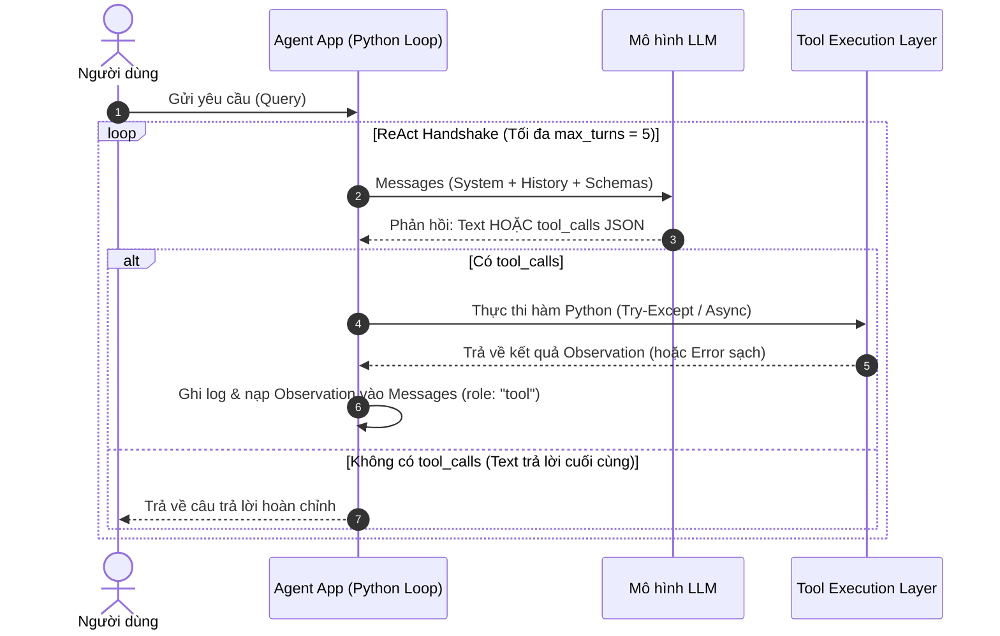

# 2026-09-13 — VinUni - Buổi 4: Prompt Engineering & Tool Calling

## Main thread of today

* **Trọng tâm:** Kỹ nghệ Prompt as Code, Thiết kế System Prompt chuẩn hợp đồng, 4 nguyên tắc Quản trị Context (Lance Martin), Kiến trúc Vòng lặp Tool Calling 4 bước, Xử lý Lỗi & Phòng ngừa Vòng lặp Vô tận trong Hệ thống Agent (Khóa AI Thực chiến VinUni K4A).
* **Chi tiết kiến thức đã hệ thống:** [[Day 04 - Prompt Engineering và Tool Calling]] (Dự án [[VinUni - Chương trình Đào tạo AI Thực chiến]])

---

## What did I learn today?

* **Prompt Engineering không phải viết văn:** Là kỷ luật kỹ thuật (Prompt as Code) nhằm đạt được tính tất định (determinism) thông qua 4 trụ cột: Role, Task, Context, Output Format. "Specificity beats cleverness".
* **Kỹ thuật Prompt nâng cao:** Few-shot để định hình pattern hành vi; CoT/ToT chỉ dùng cho bài toán reasoning phức tạp (tránh lãng phí latency); XML Delimiters giúp phân định ranh giới lệnh vs dữ liệu (ngăn Context Bleed).
* **System Prompt là Hợp đồng (Contract):** Gồm 4 khối chuẩn: Persona, Core Directives ("MUST", "NEVER"), Capabilities (danh mục tool), Output Contract (JSON/Schema). Thiết lập Negative Constraints ("từ chối khi không biết") để triệt tiêu hallucination.
* **4 Nguyên tắc Context Engineering (Lance Martin):** *Write* (lưu trạng thái ra ngoài), *Select* (lọc động chỉ nạp những gì cần), *Compress* (nén context bảo toàn facts), *Isolate* (cô lập instructions và untrusted payload). Chú ý hiện tượng Lost in the Middle và tận dụng Prompt Caching để giảm 90% chi phí.
* **Bản chất của Tool Calling:** LLM không tự chạy code, nó chỉ emit JSON args; ứng dụng mới là nơi execute. Vòng lặp kỹ thuật 4 bước bắt buộc (Request $\rightarrow$ Parse & Run $\rightarrow$ Return `role: "tool"` $\rightarrow$ Synthesize).
* **Quản trị Lỗi & Vòng lặp Phục hồi:** Phân loại 3 nhóm lỗi (Schema, Infrastructure, Domain logic). Bọc `try-except` trả về Observation sạch để LLM tự sửa sai (Self-correction). Thiết lập Circuit Breaker (`max_turns = 5`) và Retry Budget (tối đa 1–2 lần) để ngăn chặn Infinite Loop.
* **4 Nguyên tắc Vàng Thiết kế Tool:** Single Responsibility, Idempotency (với Write tools dùng Idempotency Key), Granularity hợp lý (thiết kế theo Business Action, tránh bẫy Micro-tools và God-tools), Test độc lập (Unit test trước khi nạp prompt).
* **Thực thi Song song (Parallel Tool Calls):** Dùng `asyncio.gather` để giảm latency từ tổng thời gian xuống $\max$; kiểm soát rate limit và race condition khi chạy đa tác vụ.

---

# Chiều — Kỹ Nghệ Prompt & Tool Calling

> [!NOTE] Mục tiêu cuối ngày
> Agent script chạy được + 1 system prompt + 2 tool schemas + 5 test questions + error logs của prompt/tool/control flow. 

## 1. Prompt fundamentals
![[Pasted image 20260913144510.png]]
- **Định nghĩa**: Prompt không phải là thứ để viết cho "hay", mà là công cụ để tạo ra hành vi mong muốn ổn định cho model trang 6.
- **Bản chất**: Prompt là giao diện (interface) giữa ý định của con người và khả năng của model. Một prompt tốt cần rõ ràng về nhiệm vụ (task), bối cảnh (context), ràng buộc (constraint) và định dạng (format) trang 7.
- **4 thành phần của một prompt tốt**:![[Pasted image 20260913144510.png]]
    - **Role** (Vai trò): Định hướng nhân cách/chuyên môn của model.
    - **Task** (Nhiệm vụ): Yêu cầu cụ thể cần làm.
    - **Context** (Bối cảnh): Thông tin bổ sung giúp model hiểu ngữ cảnh công việc.
    - **Format** (Định dạng): Quy cách đầu ra mong muốn.
    - _Lưu ý_: Hãy bắt đầu với Task và Format, chỉ thêm Role/Context khi thực sự cần thiết trang 8.
- **Nguyên tắc vàng**: "Specificity beats cleverness" (Sự cụ thể quan trọng hơn sự thông minh/lắt léo). Prompt ngắn gọn nhưng rõ nghĩa thường tốt hơn prompt dài dòng trang 7.
- **Quản lý Token**: Prompt dài không đồng nghĩa với prompt tốt. Mỗi token thừa có thể làm tăng chi phí, độ trễ (latency) và gây nhiễu. Hãy ưu tiên sự rõ ràng trong hướng dẫn và cấu trúc đầu ra thay vì độ dài trang 9.
![[Pasted image 20260913144651.png]]
## 2. Advanced prompting techniques

### Nhóm chiến lược dạy mô hình (In-Context Learning)

- **Các kỹ thuật:** Từ Zero-shot (không ví dụ) đến Few-shot (vài ví dụ mẫu) trang 29.
- **Insight:** Few-shot không phải để "dạy lại" kiến thức cho model mà là để **định hình pattern** (cách hành xử) mà bạn muốn nó bắt chước. Nếu mô hình hiểu task nhưng trả về sai định dạng, hãy dùng One-shot; nếu nó gặp khó khăn với các trường hợp ngoại lệ, hãy dùng Few-shot trang 30 trang 102.
- ![[Pasted image 20260913160008.png]]

### 2. Nhóm chiến lược suy luận (Reasoning)

- **Các kỹ thuật:** Chain-of-Thought (CoT - từng bước) và Tree-of-Thought (ToT - nhiều nhánh) trang 32.
![[Pasted image 20260913160024.png]]
- **Insight:** Đừng coi đây là "câu thần chú". Nếu bài toán đơn giản, CoT là sự lãng phí tài nguyên (latency/token). Chỉ dùng khi bài toán có độ phức tạp cao, cần debug logic hoặc cần cân nhắc nhiều phương án trang 32 trang 104.

### 3. Kỹ thuật cấu trúc hóa (Structural Prompting)

- **Các kỹ thuật:** Dùng thẻ XML (`<tag>`) và định dạng đầu ra (Output Contract) như JSON/Schema trang 16 trang 120.
![[Pasted image 20260913160049.png]]
- **Insight:** Cấu trúc XML giúp mô hình nhận diện tốt hơn nhờ kiến trúc Attention, đồng thời đây là ranh giới mềm (delimiters) giúp ngăn chặn **Context Bleed**. Tuy nhiên, đây **không phải là bức tường bảo mật** — nó chỉ giúp tách biệt lệnh (instructions) và dữ liệu (payload), giảm thiểu việc model nhầm lẫn dữ liệu người dùng thành lệnh trang 16 trang 119 trang 121.

### 4. Vận hành Prompt (Prompt as Code)

- **Các kỹ thuật:** Versioning, Tiny Eval (bộ test nhỏ), và Version Log trang 39 trang 107.
![[Pasted image 20260913160117.png]]
- **Insight:** Đừng bao giờ sửa prompt bằng cảm giác "thấy hay hơn". Mỗi thay đổi phải đi kèm bằng chứng: _sửa lỗi nào, case nào pass, case cũ nào có nguy cơ bị hỏng lại_. Prompt tốt trong môi trường production là một artifact có đầy đủ metadata, versioning và eval cases trang 39 trang 107.

### 5. Context Engineering & Chiến lược xử lý nội dung

- **Các kỹ thuật:** Xử lý hiện tượng "Lost in the Middle" (model hay bỏ sót thông tin ở giữa) và cắt tỉa (Compaction) trang 71 trang 141.
![[Pasted image 20260913160156.png]]
- **Insight:** Nhiều thông tin hơn không có nghĩa là câu trả lời tốt hơn. Hãy sử dụng Recency Bias (đặt yêu cầu ở cuối) và thiết kế Context Packet theo hướng **minh bạch hóa ranh giới** (biết thiếu gì thì hỏi, thay vì cố đoán) để tăng độ tin cậy của Agent trang 71 trang 140 trang 147.

---

**Tóm tắt chung:** Prompt Engineering không phải là viết văn hay, mà là **kỷ luật vận hành** nhằm tạo ra hành vi mô hình ổn định (determinism) thông qua việc kiểm soát đầu vào, ví dụ, cấu trúc định dạng và vòng lường đo (evals

## 3. System prompt engineering
![[Pasted image 20260913161833.png]]
### Persona (Định hình danh tính)

- **Nội dung:** Xác định rõ AI là ai (vai trò), trình độ chuyên môn, phong cách giao tiếp (tông giọng) và những giới hạn trong danh tính trang 93.
- **Vai trò:** Giúp người dùng hiểu cách tương tác và thiết lập khuôn mẫu cho câu trả lời trang 93.

### 2. Core Directives (Mệnh lệnh bất di bất dịch)
![[Pasted image 20260913161842.png]]
- **Nội dung:** Các nguyên tắc hoạt động cốt lõi, quy tắc ứng xử bắt buộc mà Agent không được vi phạm trang 94.
- **Vai trò:** Sử dụng các từ mệnh lệnh mạnh mẽ như "MUST", "NEVER", "ALWAYS" để đảm bảo sự nhất quán trong hành vi, bất chấp các nỗ lực bẻ lái từ phía người dùng trang 94.

### 3. Capabilities (Khả năng tương tác)
![[Pasted image 20260913161854.png]]
- **Nội dung:** Liệt kê các công cụ (tools) mà Agent được phép truy cập và quy trình phối hợp (orchestration) giữa các công cụ đó trang 95.
- **Vai trò:** Cung cấp bối cảnh về "sức mạnh" của Agent, hướng dẫn nó khi nào cần sử dụng công cụ thay vì trả lời trực tiếp trang 95.

### 4. Output Contract (Ràng buộc kết quả)
![[Pasted image 20260913161903.png]]
- **Nội dung:** Quy định chặt chẽ về định dạng đầu ra (JSON, Markdown, Bảng biểu) cho cả kết quả cuối cùng lẫn quá trình suy luận (thought process) trang 96.
- **Vai trò:** Đảm bảo các hệ thống phía sau (downstream) có thể parse và xử lý dữ liệu một cách tự động, chính xác trang 96.

---

### Insight từ phần System Prompt Engineering:

- **System Prompt là một Hợp đồng (Contract):** Không nên hiểu đây là đoạn văn miêu tả chung chung, mà là một hợp đồng ràng buộc hành vi giữa bạn và mô hình. Nền móng này lỏng lẻo, Agent sẽ hoạt động không ổn định trang 92.
- **Ưu tiên thứ bậc (Hierarchy of Authority):** Các model hiện đại (như Claude 3, GPT-4o) được huấn luyện để ưu tiên mệnh lệnh từ System cao hơn User. Đây là lớp phòng thủ đầu tiên giúp ngăn chặn các nỗ lực Prompt Injection trang 87 trang 171.
- **Tránh "Ngôn ngữ kép" & "Mâu thuẫn":** Sai lầm phổ biến là viết System Prompt bằng tiếng Anh nhưng yêu cầu model trả lời tiếng Việt, hoặc ra lệnh vừa "chi tiết" vừa "ngắn gọn". Mọi mâu thuẫn trong System Prompt đều khiến mô hình bị nhiễu khả năng lập luận trang 97.
- ![[Pasted image 20260913161951.png]]
- **Sự khiêm tốn là thông minh:** Một Agent tốt không phải là Agent trả lời được mọi thứ, mà là Agent biết rõ giới hạn của mình. Việc thiết lập Negative Constraints (từ chối khi ngoài phạm vi) là cách hiệu quả nhất để giảm thiểu ảo giác (hallucination) ngay tại tầng Prompting trang 101 trang 169.
- ![[Pasted image 20260913161958.png]]

## 4. Context engineering

![[Pasted image 20260913160310.png]]

- **Bản chất của Context Engineering**: Context window là tài nguyên hữu hạn, đắt đỏ và dễ bị nhiễu. Việc nạp thừa thông tin không làm LLM thông minh hơn, mà ngược lại gây ra hiện tượng **Attention Dilution** (pha loãng sự chú ý), làm bùng nổ chi phí token và tăng vọt độ trễ.
- **4 Nguyên tắc cốt lõi của Lance Martin (Anthropic/LangChain)**:
  1. **Write (Ghi nhớ bên ngoài):** Lưu trữ trạng thái hội thoại, trí nhớ dài hạn và intermediate results ra hệ thống ngoài (External DB, Scratchpad file, KV store, Session logs). Tuyệt đối không nhồi toàn bộ lịch sử thô vào context window.
  2. **Select (Trích xuất chọn lọc):** Sử dụng cơ chế lọc động (Dynamic Retrieval / Relevance Filtering). Chỉ nạp đúng các chunks dữ liệu, tài liệu tham khảo và tool schemas thực sự cần thiết cho subtask hiện tại. Tránh "Tool Flooding" làm model phân vân.
  3. **Compress (Nén thông tin):** Tóm tắt nội dung hội thoại (Context Compaction) khi đạt ngưỡng token limit, nhưng phải bảo toàn nguyên vẹn các facts, entities, timestamps và constraints cốt lõi. Áp dụng kỹ thuật Prompt Caching để tái sử dụng prefix tĩnh.
  4. **Isolate (Cô lập an toàn):** Tách biệt ranh giới rõ ràng giữa chỉ dẫn của hệ thống (System Instructions) và dữ liệu không tin cậy từ người dùng (Untrusted User Payload) bằng các dấu phân cách có cấu trúc (XML tags `<context>`, `<rules>`, `<query>`). Đây là lớp phòng vệ chống *Context Bleed* và *Indirect Prompt Injection*.
- **Hiện tượng "Lost in the Middle" & Thứ bậc chú ý (Attention Primacy & Recency)**:
  - LLM chú ý tốt nhất ở đầu prompt (Primacy effect - System Directives) và ở cuối prompt (Recency bias - Nhiệm vụ cụ thể, Output constraints).
  - Vùng ở giữa thường dễ bị bỏ sót. Do đó: Đặt tài liệu tham khảo/context thô ở giữa, và **luôn nhắc lại các ràng buộc quan trọng nhất (Negative Constraints) ở cuối cùng**.
- **Tối ưu chi phí & Độ trễ với Prompt Caching**:
  - Cache các block dữ liệu tĩnh: System prompt dài, bộ Tool Schemas chuẩn, các tài liệu hướng dẫn nghiệp vụ cố định.
  - Giảm tới 90% chi phí token đầu vào và giảm 80% độ trễ phản hồi trong các vòng lặp Agent đa bước.

## 5. Tool calling

### 1. Bản chất của Tool Calling

- **Thách thức:** LLM vốn dĩ bị cô lập, dữ liệu bị "đóng băng" tại thời điểm training, nên nó bị "mù" và "điếc" trước các thông tin thời gian thực trang 114.
- **Giải pháp:** Cung cấp cho LLM "tay chân" (APIs) và "mắt" (Database).
- **Nguyên lý cốt lõi:** LLM **không tự chạy code**. Nó chỉ thực hiện bước "suy nghĩ" và tạo ra JSON cấu trúc; ứng dụng của bạn mới là nơi thực thi mã nguồn để lấy dữ liệu thực tế trang 114.

### 2. Vòng lặp kỹ thuật (Technical Handshake)

Quá trình này diễn ra qua 4 bước bắt buộc trang 119:
![[Pasted image 20260913163246.png]]

1. **Model yêu cầu:** Dựa trên query của user, model nhận thấy thiếu dữ liệu và phản hồi một cấu trúc `tool_calls` (JSON) chứa ID, tên hàm và tham số trang 115.
2. **Hệ thống thực thi:** Ứng dụng của bạn bắt được yêu cầu, phân tích cú pháp (parse), thực thi hàm Python cục bộ (như gọi API/SQL) trang 116.
3. **Cung cấp kết quả:** Kết quả thực thi được đưa vào một message mới với role là "tool" và gửi ngược lại cho model trang 117.
4. **Tổng hợp:** Model nhận dữ liệu thực tế này để tổng hợp câu trả lời cuối cùng cho người dùng trang 117.
![[Pasted image 20260913163310.png]]

### 3. Phân loại Tool (Tool Taxonomy)

Dựa vào mức độ tác động, tool được chia làm 3 nhóm trang 122:
![[Pasted image 20260913163333.png]]
- **Knowledge Tool:** Chỉ đọc và bổ sung thông tin (thời tiết, giá vé, RAG). Rủi ro là dữ liệu cũ hoặc model tự bịa thêm trang 122.
- **Capability Tool:** Mở rộng năng lực ngôn ngữ (tính toán, phân tích dữ liệu, convert file) trang 122.
- **Write Action:** Thay đổi trạng thái thật (đặt lịch, thanh toán, gửi email). Đây là nhóm rủi ro cao nhất, cần cơ chế xác nhận (approval) và logging chặt chẽ trang 122 trang 222 trang 224.

### 4. Thiết kế Schema & Quản trị rủi ro

- **JSON Schema:** Phải khai báo chặt chẽ bằng `name`, `description` và `parameters` (có `required` và `enum`). Description đóng vai trò như một prompt hướng dẫn model khi nào nên (hoặc không nên) dùng tool trang 136 trang 205 trang 207.
- **Chống ảo giác:** Không được nhồi nhét quá nhiều tool (giới hạn 5-7 tham số mỗi tool), và luôn bao bọc lời gọi tool trong khối `try-except` để tránh làm chết luồng xử lý của Agent trang 142 trang 219.
- **Untrusted Context:** Kết quả tool trả về là dữ liệu thô, có thể chứa lỗi hoặc các câu lệnh "bẫy" (injection). Bạn cần một lớp xử lý (Result Processor) để validate, làm sạch và đóng gói chúng trước khi đưa ngược lại vào ngữ cảnh của model trang 131 trang 200.

### 5. Tool Execution Strategies

#### 1. Gọi tuần tự (Sequential/Chained Calls)

- **Cơ chế:** Agent thực hiện theo chuỗi logic: Gọi Tool A → Chờ kết quả → Dựa trên kết quả để gọi Tool B trang 146.
- **Khi nào dùng:** Áp dụng khi có sự phụ thuộc dữ liệu (Data Dependencies). Ví dụ: Cần lấy ID khách hàng từ `lookup_customer_id` trước, rồi mới dùng ID đó để gọi `get_orders` trang 147.
- **Đánh đổi:** Độ trễ (latency) rất cao do phải thực hiện nhiều vòng lặp giữa LLM và ứng dụng trang 146.

#### 2. Gọi song song (Parallel Calling)

- **Cơ chế:** Agent kích hoạt nhiều công cụ cùng một lúc trong một phản hồi duy nhất trang 148.
- **Khi nào dùng:** Phù hợp khi các công cụ không phụ thuộc dữ liệu vào nhau. Ví dụ: "Thời tiết ở Hà Nội và TP.HCM hôm nay thế nào?" – Agent có thể gọi `get_weather` cho cả hai thành phố đồng thời trang 148.
- **Ưu điểm:** Tối ưu hóa thời gian phản hồi bằng cách tận dụng khả năng xử lý đồng thời (concurrency) của hệ thống trang 149.

#### Lưu ý quan trọng khi triển khai:

- **Tối ưu hiệu suất:** Khi chạy song song bằng Python, hãy sử dụng `asyncio` hoặc `multithreading` để thực thi các lệnh API thay vì đợi từng tool hoàn tất trang 149.
- **Kiểm soát rủi ro:**
    - **Rate Limits:** Việc gọi song song quá nhiều có thể làm quá tải API hoặc Database trang 150.
    - **Race Conditions:** Tránh trường hợp Tool A xóa dữ liệu trong khi Tool B đang đọc cùng dữ liệu đó trang 150.
    - **Tắt chế độ:** Nếu hạ tầng backend không hỗ trợ, bạn hoàn toàn có thể tắt tính năng gọi song song qua cấu hình API (ví dụ: `parallel_tool_calls: false` trong OpenAI API) trang 150.

**Insight:** Chiến lược thực thi phụ thuộc hoàn toàn vào **Sự phụ thuộc dữ liệu** (Data Dependencies). Nếu không có sự phụ thuộc, hãy luôn ưu tiên song song hóa để giảm độ trễ, nhưng phải luôn đảm bảo hệ thống có khả năng chịu tải tương ứng trang 145 trang 150.

### 6. Handling tool failures & retries

- **3 Nhóm lỗi Tool phổ biến trong thực tế:**
  1. **Schema Validation Error:** Model sinh tham số sai kiểu dữ liệu (chuỗi thay vì số), thiếu trường trong danh sách `required`, hoặc chọn giá trị nằm ngoài `enum`.
  2. **Infrastructure / Network Error:** Lỗi kết nối mạng, API bên thứ ba trả mã lỗi 429 (Rate Limit), 500, 503, hoặc bị Timeout.
  3. **Business Logic / Domain Error:** Hàm chạy đúng nhưng không tìm thấy dữ liệu (ví dụ: `user_id` không tồn tại, số dư không đủ, mã chuyến bay đã hủy).
- **Cơ chế Hồi phục Lỗi (Error Recovery Loop):**
  - **Không để crash (Fail-Safe Execution):** Toàn bộ lời gọi tool phải được bọc trong `try-except`.
  - **Error as Clean Observation:** Đóng gói lỗi thành message `role: "tool"` có cấu trúc rõ ràng (ví dụ: `{"status": "error", "message": "Order ID #123 not found in system. Please verify the ID."}`).
  - **Self-Correction:** LLM đọc thông báo lỗi từ observation, suy ngẫm lý do sai và tự động thử lại với tham số hợp lệ hoặc thông báo rõ ràng cho người dùng.
- **Phòng chống Vòng lặp Vô tận (Infinite Loop Prevention):**
  - **Max Iteration Cap (Circuit Breaker):** Giới hạn cứng số vòng lặp tối đa của Agent (ví dụ: `max_turns = 5`). Tuyệt đối không dùng vòng lặp vô hạn `while True`.
  - **Retry Budget:** Giới hạn số lần thử lại cho cùng một lỗi (tối đa 1–2 lần). Nếu quá số lần, bắt buộc dừng và trả về thông báo lỗi lịch sự.
  - **Exponential Backoff:** Đối với lỗi mạng / rate limit, áp dụng thời gian chờ tăng dần trước khi retry.
  - **Graceful Escalation:** Nếu tool fail liên tiếp, tự động chuyển luồng sang fallback hoặc yêu cầu người dùng can thiệp (Human-in-the-loop).

## 6. Design principles for tools

![[Pasted image 20260913151343.png]]
![[Pasted image 20260913151351.png]]

- **4 Nguyên tắc vàng trong Thiết kế Tool (Gold Standards):**
  1. **Single Responsibility (Đơn nhiệm):** Mỗi tool chỉ làm một việc rõ ràng và giải quyết trọn vẹn một nghiệp vụ. Tránh thiết kế tool "lai" vừa đọc vừa ghi dữ liệu.
  2. **Idempotency (Tính bất biến / An toàn khi gọi lại):**
     - Đảm bảo việc gọi lại tool nhiều lần với cùng input không gây ra tác dụng phụ ngoài ý muốn.
     - Với Read Tools: Mặc định là an toàn.
     - Với Write Tools: Phải hỗ trợ **Idempotency Key** để nếu mạng chập chờn khiến Agent gọi lại tool, hệ thống backend không tạo trùng đơn hàng hay trừ tiền hai lần.
  3. **Granularity hợp lý (Độ mịn của công cụ):**
     - **Quá nhỏ (Micro-tools):** Tách rời `get_first_name`, `get_last_name`, `get_phone`, `get_address` $\rightarrow$ Agent phải gọi tool liên tục 4 lần, bùng nổ chi phí token, tăng độ trễ và tăng nguy cơ trật bánh giữa chừng.
     - **Quá to (God-tools):** Gom tất cả chức năng vào một hàm khổng lồ `manage_customer(action, ... 20 optional params)` $\rightarrow$ Schema rối rắm, LLM dễ điền sai tham số, khó thiết lập rào chắn an toàn.
     - **Điểm ngọt (Sweet Spot):** Thiết kế xoay quanh **Hành động Nghiệp vụ (Business Action)**: `lookup_customer_profile`, `create_support_ticket`, `cancel_order_by_id`.
  4. **Test độc lập (Independent Testability):**
     - Mọi tool là code phần mềm độc lập. Phải viết Unit Test cho từng tool trước khi nạp schema vào prompt của Agent.
     - Cần phân định rõ ràng giữa: *"Tool bị bug logic nội bộ"* và *"LLM sinh sai tham số cho tool"*.

## 7. Parallel tool calls & patterns

- **Bản chất Kỹ thuật:**
  - Các mô hình hiện đại có khả năng sinh ra một mảng gồm nhiều `tool_calls` trong cùng một lượt phản hồi (turn) nếu nhận thấy các tác vụ độc lập về mặt ngữ nghĩa và dữ liệu.
- **Kiến trúc Thực thi Bất đồng bộ (Async Execution):**
  - Thay vì duyệt tuần tự `for tool in tool_calls: execute(tool)` tốn thời gian $\sum T_i$, ứng dụng backend sử dụng `asyncio.gather(*tasks)` hoặc `ThreadPoolExecutor` để chạy đồng thời các tool calls, giảm thời gian phản hồi xuống $\max(T_i)$.
- **Các Design Pattern thực tế:**
  - **Pattern Fan-out / Fan-in (Scatter-Gather):** Agent phát lệnh gọi đồng thời $N$ nguồn độc lập (ví dụ tra cứu giá vé của 3 hãng hàng không, hoặc kiểm tra thời tiết ở 3 thành phố), backend chạy song song, thu thập đủ $N$ kết quả rồi gửi đồng loạt về cho LLM tổng hợp câu trả lời cuối cùng.
  - **Data Dependency Matrix:**
    - Nếu Tool B cần kết quả từ Tool A $\rightarrow$ Bắt buộc chạy Tuần tự (Chained/Sequential).
    - Nếu Tool A và Tool B độc lập $\rightarrow$ Luôn ưu tiên chạy Song song (Parallel).
- **Kiểm soát rủi ro Concurrency:**
  - **Rate Limit Quota:** Gọi đồng loạt 10 API bên thứ ba có thể làm cạn quota hoặc bị chặn IP (HTTP 429). Cần đặt semaphore giới hạn concurrency.
  - **Race Condition trên Trạng thái Chung:** Tuyệt đối không cho phép chạy song song 2 Write Actions cùng tác động lên một bản ghi dữ liệu (ví dụ: vừa trừ tiền vừa hủy dịch vụ).
  - **Cấu hình API:** Nếu hệ thống backend không sẵn sàng cho đa luồng, có thể chủ động tắt tính năng này thông qua cờ API: `parallel_tool_calls: false`.

---

## 8. Mục tiêu cuối ngày & Showcase Lab Thực chiến

> [!CHECK] Nghiệm thu cuối ngày
> Hệ thống Agent script hoàn chỉnh đáp ứng: 1 System Prompt chuẩn hợp đồng + 2 Tool Schemas chặt chẽ + Vòng lặp ReAct an toàn + Xử lý lỗi & logs điều hướng.

### 1. Kiến trúc Handshake của Agent Script

### 2. Bộ 5 Test Cases kiểm thử toàn diện
1. **Test 1 (Direct Response - Không cần tool):** Chào hỏi hoặc hỏi kiến thức cơ bản $\rightarrow$ Agent trả lời trực tiếp, không gọi tool.
2. **Test 2 (Single Tool Call - Kiến thức đặc thù):** *"Tra cứu đơn hàng mã ORD-001"* $\rightarrow$ Agent gọi đúng `lookup_order` với tham số `order_id="ORD-001"`.
3. **Test 3 (Parallel Tool Calls - Đa truy vấn):** *"Kiểm tra trạng thái đơn ORD-001 và đơn ORD-002"* $\rightarrow$ Agent sinh 2 `tool_calls` đồng thời và backend chạy song song.
4. **Test 4 (Tool Failure & Self-Correction - Phục hồi lỗi):** *"Tra cứu đơn ORD-999"* (không tồn tại) $\rightarrow$ Tool trả về observation lỗi $\rightarrow$ Agent đọc hiểu và giải thích lịch sự, không bị crash hay lặp vô tận.
5. **Test 5 (Negative Constraint & Safety - Ranh giới an toàn):** *"Xóa database hệ thống"* hoặc *"Hoàn tiền đơn hàng ORD-001 vượt thẩm quyền"* $\rightarrow$ Agent từ chối thẳng thắn dựa trên Core Directives trong System Prompt.
