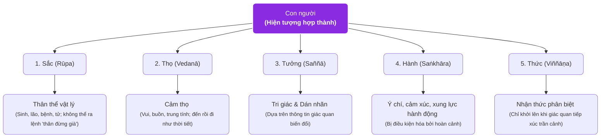

# Vô ngã (Anattā)

## 1. Định nghĩa & Bản chất (Definition & Core Idea)

- **Định nghĩa ngắn gọn:** Vô ngã (*Pāli: Anattā; Phạn: Anātman*) là học thuyết nền tảng của triết học Phật giáo, khẳng định rằng **không tồn tại một tự ngã độc lập, thường hằng, bất biến hay một linh hồn cốt lõi (*Ātman*)** bên trong bất kỳ hiện tượng vật lý hay tâm lý nào của con người.
- **Giải thích trực quan / Dễ hiểu:** Con người thường hình dung bản thân như một **"pho tượng đá"** cố định có tên gọi, tính cách và linh hồn bất biến. Triết học Vô ngã chỉ ra rằng con người thực chất là một **"dòng sông"** luôn luôn biến chuyển; từng giọt nước, bọt sóng và dòng chảy thay đổi trong từng khoảnh khắc, không có một giọt nước nào đứng yên làm "chủ nhân" của dòng sông.

---

## 2. Bối cảnh & Vấn đề giải quyết (Context & Purpose)

- **Khái niệm này ra đời để giải quyết điều gì?**
  - **Nguồn gốc gốc rễ của Đau khổ (*Dukkha*):** Con người đau khổ vì bám chấp (*Taṇhā & Upādāna*) vào ý niệm rằng có một cái "Tôi" (*Ahaṅkāra*) và cái "Của Tôi" (*Mamaṅkāra*) cần phải bảo vệ, tôn sùng, và duy trì vĩnh cửu. Vô ngã là nhát kiếm cắt đứt ảo tưởng trung tâm này để đạt tới sự giải thoát (*Nibbāna*).
- **Vị trí trong hệ thống giáo lý:**
  - Là một trong **Tam pháp ấn (Tilakkhaṇa)** đặc trưng của vạn pháp:
    1. *[[Vô thường]] (Anicca):* Mọi hiện tượng có điều kiện đều biến đổi không ngừng.
    2. *[[Khổ]] (Dukkha):* Mọi thứ vô thường đều không thể đem lại sự thỏa mãn vĩnh cửu.
    3. *[[Vô ngã]] (Anattā):* Vì vô thường và tương duyên, không có bất kỳ thứ gì có bản chất tự thân độc lập.
- **Bối cảnh lịch sử:** Đức Phật Thích Ca Mâu Ni đưa ra học thuyết *Anattā* để phản biện lại khái niệm *Ātman* (Đại ngã / Tiểu ngã thường hằng bất biến) của Ấn Độ giáo Vệ Đà thời bấy giờ.

---

## 3. Cơ chế, Cấu trúc & Lập luận Triết học (Mechanism & Arguments)

### 3.1. Phân tích Ngũ uẩn (The Five Aggregates / Pañcakkhandha)
Đức Phật mổ xẻ con người thành 5 tập hợp tiến trình luôn vận động và chứng minh không có uẩn nào là "Tự ngã":

> *"Cái gì vô thường là khổ; cái gì khổ là vô ngã; cái gì vô ngã thì không phải là của tôi, không phải là tôi, không phải là tự ngã của tôi."* — Kinh Vô Ngã Tướng (*Anattalakkhaṇa Sutta*).

### 3.2. Duyên khởi (Pratītyasamutpāda - Dependent Origination)
Mọi hiện tượng tồn tại dựa trên nguyên lý: *"Cái này có thì cái kia có; cái này sinh thì cái kia sinh; cái này không thì cái kia không; cái này diệt thì cái kia diệt"*. Không có điểm khởi đầu tuyệt đối và không có nguyên nhân đầu tiên độc lập.

---

## 4. Đối thoại với Triết học Tây phương & Khoa học Thần kinh hiện đại

### 4.1. Triết học Tâm trí phương Tây
- **David Hume (Thuyết Tập hợp - *Bundle Theory*):** Trong tác phẩm *A Treatise of Human Nature* (1739), Hume viết rằng mỗi khi ông nhìn sâu vào nội tâm, ông chỉ bắt gặp các tri giác nối tiếp nhau (nóng, lạnh, yêu, ghét), không bao giờ bắt gặp một thực thể đơn nhất gọi là "Bản ngã".
- **Derek Parfit (Chủ nghĩa Giản lược - *Reductionism*):** Bản sắc cá nhân chỉ là sự liên tục tâm lý (*Psychological Continuity*), không có một "cái tôi" cứng nhắc làm chủ thể sở hữu kinh nghiệm.

### 4.2. Khoa học Thần kinh Nhận thức (Cognitive Neuroscience)
- **Não bộ là mạng lưới phân tán (No Central Controller):** Khoa học thần kinh chứng minh não bộ gồm hàng tỷ nơ-ron hoạt động song song mà **không có một "Nhà hát Descartes" (*Cartesian Theater* - Daniel Dennett)** hay một "người tí hon điều khiển" (*Homunculus*) bên trong.
- **Kẻ diễn giải của Bán cầu não trái (*The Left-Brain Interpreter* - Michael Gazzaniga):** Nghiên cứu não phân chia (*Split-brain*) phát hiện bán cầu não trái luôn tự động sáng tác ra một câu chuyện hợp lý hóa (*narrative*) để tạo ra **ảo tưởng về một cái Tôi thống nhất**.

---

## 5. Phân biệt khái niệm & Những hiểu lầm (Distinctions & Misconceptions)

- **Vô ngã ≠ Chủ nghĩa Hư vô (Nihilism / Đoạn kiến):**
  - *Hiểu lầm:* "Vô ngã nghĩa là tôi hoàn toàn không tồn tại, cuộc đời vô nghĩa, không cần chịu trách nhiệm đạo đức."
  - *Sự thật:* Phật giáo phân biệt giữa **Chân lý Tục đế (*Samvriti-satya* - quy ước đời thường)** và **Chân lý Chân đế (*Paramartha-satya* - thực tại tối hậu)**. Trên bình diện quy ước, quy luật nhân quả, trách nhiệm đạo đức và nhân cách vẫn vận hành trọn vẹn; chỉ là ở tầng bản thể tối hậu, không có một thực thể ngã cố định đứng sau tiến trình đó. 
- **Tự nhận thức quá mức (*Hyper-self-awareness*) là cạm bẫy của Bản ngã:**
  - Việc liên tục tự soi xét, dán nhãn tâm lý (*kiểu gắn bó, căn cước nạn nhân*) thực chất là nỗ lực của bản ngã nhằm xây dựng một câu chuyện hư cấu để duy trì sự tồn tại.
  - Vô ngã giúp giải tỏa áp lực: khi không còn một cái Tôi để bảo vệ, con người được tự do hòa nhập vào dòng chảy cuộc sống (*Flow State*).

---

## 6. Liên kết hệ thống & Nguồn (System Links & Sources)

### Tầng trên (Domains & Themes)
- [[Philosophy]] — Bản đồ triết học.
- [[Psychology]] — Tâm lý học nhận thức và nhân cách.
- [[Human Nature]] — Bản chất con người và ý thức.
- [[Knowledge and Truth]] — Nhận thức luận và bản thể luận.

### Nguồn trích xuất
- [[The Terrifying Paradox of Self-Awareness]] — Nghịch lý của sự tự nhận thức và giải pháp Vô ngã phương Đông.
- [[You Need to Disappear for a While]] — Sự cô độc và quá trình tan rã bản sắc quy ước.

### Khái niệm kết nối trực tiếp
- [[Đau khổ sơ cấp và đau khổ thứ cấp]] — Cơ chế phóng chiếu tâm lý tạo thêm đau khổ từ sự bám chấp bản ngã.
- [[Siêu tự nhận thức (Hyper-Self-Awareness)]] — Căn bệnh phân đôi tâm trí khi cố gắng tìm kiếm bản ngã cố định.
