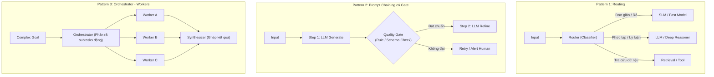
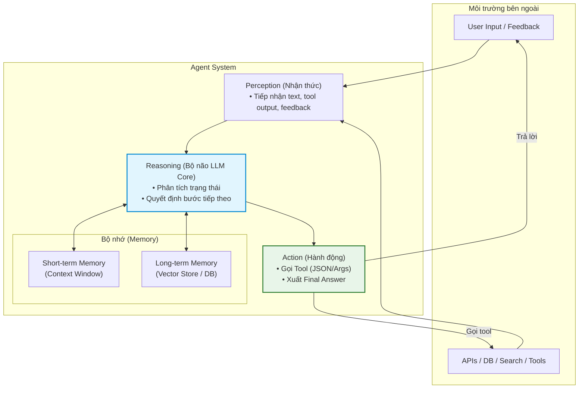
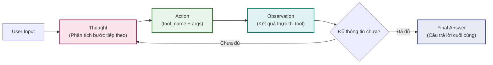

# Day 03 — Thiết Kế Workflow & Kiểm Soát Hệ Thống AI

Bản tổng hợp có hệ thống toàn bộ 30 thẻ tri thức về **Khám phá vấn đề HCD, Kiến trúc Workflow, Mức tự chủ, Đánh giá đầu tư và Mức sẵn sàng Production** trong chương trình **AI Thực chiến VinUni (Lớp K4A)**.

> [!TIP] **Tư duy Hệ thống Chỉ đạo**
> *"Một vài output đúng trong demo không chứng minh được hệ thống sẵn sàng cho Production. Thiết kế sản phẩm AI thực chiến là thiết kế quy trình kiểm soát rủi ro, phân định ranh giới tự chủ và xây dựng cơ chế hạ cánh an toàn (Graceful Failure) khi mô hình xác suất gặp lỗi."*

---

## 1. Khám Phá Vấn Đề Lấy Con Người Làm Trung Tâm (Human-Centered Discovery)

```text
[Thấu hiểu / Quan sát] ──> [Định nghĩa bài toán] ──> [Lên ý tưởng] ──> [Prototype] ──> [Kiểm thử (Test)]
         ▲                              ▲                   ▲                │
         │                              └───────────────────┴────────────────┘
         └───────────── Phản hồi phủ nhận nhu cầu ───────────┘
```

* **1.1. Đưa feedback người dùng về đúng bước của vòng lặp HCD:**
  * Vòng lặp HCD chuẩn: *Thấu hiểu $\rightarrow$ Định nghĩa $\rightarrow$ Lên ý tưởng $\rightarrow$ Prototype $\rightarrow$ Test*.
  * *Phân loại phản hồi:*
    * Nếu feedback **phủ nhận nhu cầu cốt lõi** $\rightarrow$ Bắt buộc phải quay về bước **Định nghĩa bài toán**.
    * Nếu feedback về **độ khó sử dụng hoặc cách thức thi hành** $\rightarrow$ Quay về bước **Lên ý tưởng (Ideation)** hoặc tinh chỉnh **Prototype** tương ứng.
* **1.2. Chuyển yêu cầu giải pháp AI thành bài toán người dùng:**
  * Những yêu cầu như *"làm chatbot AI"* hay *"tích hợp LLM"* chỉ mới nêu giải pháp bề nổi. Chúng hoàn toàn chưa nêu rõ: *Ai bị ảnh hưởng? Workflow nào bị tắc nghẽn? Tác động đo được là gì? Kết quả mong muốn ra sao?*
  * Khám phá thực tế phải bắt đầu từ vấn đề nghiệp vụ và **luôn giữ phương án mở cho giải pháp không dùng AI**.
* **1.3. Phỏng vấn khám phá tập trung vào Workflow:**
  * Phỏng vấn khám phá cần khôi phục lại các chi tiết thực tế: *Lần xảy ra gần đây nhất, workflow và các điểm bàn giao (handoff) hiện tại, tần suất lặp lại, mức độ tác động, hậu quả khi xảy ra sai sót, ai là người có quyền quyết định và tiêu chuẩn thành công* trước khi đề xuất bất kỳ giải pháp nào.
* **1.4. Nhận diện điểm đau có bằng chứng trong Workflow:**
  * Một bài toán sản phẩm hữu ích phải gắn chặt với: Một *actor* xác định, một bước workflow lặp lại, ma sát quan sát được và **bằng chứng định lượng** (tần suất, số phút lãng phí, tỷ lệ lỗi, phàn nàn của người dùng hoặc thiệt hại tài chính); tuyệt đối không dựa vào lợi ích công nghệ tưởng tượng.

---

## 2. Bằng Chứng & Lựa Chọn Bài Toán Ứng Viên (Candidate Selection)

* **2.1. Ánh xạ giải pháp hiện có vào Workflow:**
  * So sánh các công cụ và pattern hiện có trên thị trường với workflow của bài toán ứng viên: *Chúng xử lý được bước nào? Lời khẳng định (claim) dựa vào nguồn nào? Phần nào còn bỏ ngỏ chưa xử lý được? Những rủi ro hay giả định nào sẽ đi theo khi áp dụng vào bối cảnh tổ chức cụ thể?*
* **2.2. Ưu tiên cơ hội bằng Ma trận Tác động – Nỗ lực (Impact-Effort Matrix):**
  * So sánh lợi ích kỳ vọng khi giải một vấn đề có bằng chứng với số người dùng, thời gian, chi phí và độ phức tạp kỹ thuật phải bỏ ra.
  * Các ứng viên *"High-Impact, Low-Effort"* là các *Quick-win*, nhưng **độ chắc chắn của các giả định ước lượng** phải được kiểm tra kỹ, tránh rơi vào cái bẫy ước lượng lạc quan thiên vị.
* **2.3. Thực hiện kiểm chứng nhanh bài toán (Quick Validation):**
  * Sử dụng phỏng vấn nhanh, micro-survey, poll, phân tích logs hệ thống hoặc mẫu ticket hỗ trợ để kiểm tra xem điểm đau có thực sự lặp lại hay không.
  * Cả tín hiệu xác nhận (confirmation) lẫn tín hiệu phản bác (refutation) đều phải làm thay đổi định nghĩa bài toán hoặc được giữ lại dưới dạng **độ không chắc chắn (uncertainty)** cần theo dõi.

---

## 3. Định Hình & Định Lượng Workflow (Workflow Scoping & Metrics)

* **3.1. Định lượng Baseline và Nút thắt của Workflow:**
  * *Baseline:* Cho biết lượng thời gian tiêu hao, khối lượng công việc, tỷ lệ sai lỗi, chi phí vận hành hoặc SLA ảnh hưởng hiện tại.
  * *Nút thắt (Bottleneck):* Là bước duy nhất có bằng chứng đang giới hạn thông lượng của toàn bộ quy trình; mọi mục tiêu cải thiện phải nhắm thẳng vào nút thắt này kèm phương pháp đo lường đã định trước.
* **3.2. Lập bản đồ Workflow hiện trạng (Current State Map):**
  * Lần theo đúng chuỗi bước thực tế: *Actor thực hiện $\rightarrow$ Input đầu vào $\rightarrow$ Output đầu ra $\rightarrow$ Công cụ sử dụng $\rightarrow$ Các điểm bàn giao (handoff)* trước khi đề xuất AI. Làm rõ công việc và trách nhiệm đang di chuyển ở đâu giữa các phòng ban.
* **3.3. Thiết kế lại Workflow tương lai có thể đo lường (Future State Map):**
  * Tái phân bổ các bước cụ thể cho 3 chủ thể: **Rule (luật quy tắc)**, **AI (mô hình suy luận)**, và **Con người (kiểm duyệt)**.
  * Giữ lại các điểm bàn giao cần thiết, làm lộ diện các rủi ro mới phát sinh và so sánh nỗ lực kỳ vọng với baseline hiện tại.
  * *Nguyên tắc cốt lõi:* Workflow tương lai không phải là *"workflow cũ chỉ gắn thêm một ô AI"*, mà là tái cấu trúc luồng giá trị.

---

## 4. Độ Phù Hợp AI & Trách Nhiệm Hệ Thống (AI Suitability & Responsibility)

* **4.1. Audit bằng chứng về mức sẵn sàng AI (AI Readiness Audit):**
  * Mức sẵn sàng là trạng thái dựa trên bằng chứng kiểm chứng được:
    * [x] Workflow và Owner đã xác định rõ ràng.
    * [x] Có ngữ cảnh đầu vào (context input) sạch và đầy đủ.
    * [x] Có baseline đối chứng và kế hoạch đánh giá (*Eval Plan*).
    * [x] Hiểu rõ hậu quả sai lỗi và có cơ chế kiểm soát (*Controls*).
    * [x] Đội ngũ vận hành bước tiếp theo có ranh giới hành động rõ ràng.
  * *Lưu ý:* Việc thiếu một vài bằng chứng có thể khắc phục không đồng nghĩa tác vụ đó không hợp với AI, nhưng phải bổ sung đủ trước khi quyết định build.
* **4.2. Đánh giá tác vụ có hưởng lợi từ AI không:**
  * **Nên dùng AI khi:** Dữ liệu đầu vào biến thiên cao, đòi hỏi xử lý ngôn ngữ tự nhiên hoặc thị giác máy tính, cần khái quát hóa pattern phức tạp, hoặc các quyết định đòi hỏi ngữ cảnh mở rộng.
  * **Nên dùng Rule hoặc sửa quy trình khi:** Công việc có logic ổn định, dễ dự đoán, tính chất tĩnh, rủi ro sai sót cực cao, đòi hỏi tính minh bạch/giải trình 100%, hoặc giải quyết rất rẻ bằng mã nguồn truyền thống.
* **4.3. Phân định: LLM làm trực tiếp vs. Cần cơ chế hỗ trợ:**
  * LLM rất mạnh về hiểu ngôn ngữ tự nhiên và phán đoán ngữ nghĩa, nhưng **hoàn toàn không thể thay thế**: Tính toán tất định (deterministic math), tri thức nội bộ riêng tư/mới cập nhật, tìm kiếm trên đồ thị quan hệ phức tạp, hay thực thi hành động ngoài đời thực.
  * Sản phẩm đáng tin cậy bắt buộc phải chuyển giao các nhu cầu này cho: **Mã lệnh (Code)**, **Truy xuất thông tin (Retrieval/RAG)**, **Dữ liệu có cấu trúc** hoặc **Công cụ ngoài (Tools/APIs)**.
* **4.4. Chọn cấp độ giải pháp đơn giản nhất nhưng đủ dùng:**
  * $\text{Rule} \longrightarrow \text{Workflow} \longrightarrow \text{Agent}$
  * *Rule:* Logic ổn định, xác định, không đổi.
  * *Workflow:* Ghép các bước đã biết trước với lời gọi model có ranh giới đóng gói.
  * *Agent:* Chỉ dành cho công việc nhiều bước thực sự cần tự lập kế hoạch thích ứng động và tự chọn tool. Luôn tuân thủ nguyên tắc hạ cấp (*Downgrade Principle*).
* **4.5. Định nghĩa ranh giới xử lý dữ liệu khách hàng nhạy cảm (Data Boundary):**
  * Xử lý dữ liệu nhạy cảm phải nêu rõ: AI được đọc gì, con người được thấy gì, dữ liệu có được lưu lại không, xử lý ở hạ tầng nào và cần biến đổi ra sao (che mờ - masking, khử định danh - pseudonymization, trích xuất đặc trưng).
  * Sự tiện lợi công nghệ tuyệt đối không được vượt qua thỏa thuận khách hàng (*Terms of Service*) hoặc ranh giới truy cập (*Access Boundary*).

---

## 5. Các Pattern Kiến Trúc Workflow (Workflow Architectural Patterns)

Ba mẫu hình kiến trúc cơ bản để ghép nối các thành phần trong hệ thống AI:



* **5.1. Dùng Orchestrator – Workers cho subtask chưa biết trước:**
  * *Khi nào dùng:* Chỉ hợp lý khi hệ thống **không thể liệt kê danh sách subtask trước** khi tiếp nhận request thực tế từ người dùng.
  * *Cơ chế:* Orchestrator phân chia công việc động dựa trên ngữ cảnh; các Workers xử lý độc lập các subtask được giao; Synthesizer tổng hợp và ghép nối kết quả cuối cùng.
  * *Trade-off:* Độ linh hoạt cao sẽ đánh đổi lại chi phí token phình to và hành vi của hệ thống trở nên khó dự đoán hơn.
* **5.2. Thiết kế Prompt Chaining có Gate cho phụ thuộc tuần tự:**
  * *Khi nào dùng:* Phù hợp khi output của bước trước là input bắt buộc cho bước kế tiếp.
  * *Cơ chế:* Đặt các **Gate (cổng kiểm tra)** bằng code/rule để thẩm định kết quả trung gian trước khi cho phép chuỗi thực thi bước tiếp theo.
  * *Trade-off:* Tăng mạnh khả năng kiểm soát chất lượng và triệt tiêu lỗi dây chuyền (*error propagation*), nhưng phải trả thêm độ trễ (*latency*).
* **5.3. Thiết kế Routing cho các lớp Input khác nhau:**
  * *Khi nào dùng:* Phân loại input đầu vào để chuyển hướng (route) đến các nhánh xử lý, mô hình hoặc công cụ chuyên biệt.
  * *Cơ chế:* Tách biệt các yêu cầu dễ (dùng mô hình nhỏ/rẻ, phản hồi nhanh) và yêu cầu khó (dùng mô hình lớn, suy luận sâu), cân đối chi phí và thời gian.
  * *Điều kiện tiên quyết:* Bộ phân loại ban đầu (*Classifier/Router*) phải đạt độ chính xác rất cao để không chuyển nhầm nhánh.

---

## 6. Mức Tự Chủ & Kiểm Soát Con Người (Autonomy & Human Control)

* **6.1. Chọn Automation hay Augmentation cho từng tác vụ:**
  * *Automation:* Giao toàn bộ quyền cho AI thực thi tự động.
  * *Augmentation:* Giữ con người làm chủ thể thực hiện chính, AI đóng vai trò trợ lực (co-pilot/kính lúp).
  * *Tiêu chí lựa chọn:* Phụ thuộc vào mong muốn tự làm của người dùng, mức độ rủi ro khi sai, trách nhiệm pháp lý gắn với ai, và giá trị thực sự đến từ việc hỗ trợ hay thay thế.
* **6.2. Hỏi làm rõ khi thiếu ý định hoặc ngữ cảnh (Disambiguation):**
  * Khi thiếu intent (ý định), constraint (ràng buộc nghiệp vụ) hoặc context bắt buộc, giải pháp kiểm soát an toàn nhất là **hỏi đúng một điểm còn mờ** hoặc **đưa ra danh sách lựa chọn có giới hạn** trước khi thực hiện.
  * Đoán mò sẽ biến sự bất định tự nhiên thành lỗi sản phẩm hoàn toàn có thể phòng tránh được.
* **6.3. Trả quyền kiểm soát cho người dùng khi Automation hỏng (Graceful Failure):**
  * Hệ thống phải phát hiện sớm các cấu phần hoặc kết quả bị hỏng, khoanh vùng lỗi (*error isolation*) để không làm bẩn ngữ cảnh phía sau.
  * Thông báo minh bạch phạm vi bị ảnh hưởng, giữ nguyên phần công việc đã hoàn thành an toàn và đưa ra các tùy chọn rõ ràng: *thử lại (retry), kích hoạt dự phòng (fallback), mở phiên mới, hoặc chuyển giao cho con người*.
* **6.4. Đặt Phê duyệt thủ công trước hành động có hậu quả (Approval Gates):**
  * Cổng phê duyệt (*Approval Gate*) **bắt buộc phải nằm TRƯỚC** hành động có hậu quả lớn hoặc khó đảo ngược (gửi email khách hàng, xóa cơ sở dữ liệu, kích hoạt giao dịch).
  * Cổng phải hiển thị đầy đủ: Hành động dự kiến, đối tượng thụ hưởng (*recipient*), dữ liệu chi tiết (*payload*) và bối cảnh rủi ro.
  * *Cảnh báo:* Đặt một checkbox xác nhận SAU KHI hành động đã tự động thực thi xong hoàn toàn không phải là cơ chế kiểm soát an toàn.
* **6.5. Định nghĩa Miền vận hành & Chế độ suy giảm (ODD & Graceful Degradation):**
  * *Operational Design Domain (ODD):* Nêu rõ các điều kiện biên mà tại đó hiệu năng cam kết của hệ thống còn đúng (môi trường vận hành, chất lượng input đầu vào, định dạng tài liệu được hỗ trợ).
  * *Graceful Degradation:* Khi điều kiện vượt ngoài ODD, hệ thống phải tự động cảnh báo, hạ cấp tính năng, dừng an toàn hoặc bàn giao cho con người thay vì cố chấp duy trì lời hứa hiệu năng ban đầu.

---

## 7. Tiêu Chí Thành Công & Quyết Định Đầu Tư (Success Criteria & Decision)

* **7.1. Khung Ra Quyết Định: Go — Not Yet — No-Go:**
  * **GO:** Bằng chứng và cơ chế kiểm soát đã đủ cho một bước thử nghiệm có giới hạn (*Pilot*).
  * **NOT YET:** Bài toán có tiềm năng lớn nhưng còn thiếu dữ liệu, thiếu baseline, chưa rõ metric, workflow boundary hoặc owner có thể bổ sung được.
  * **NO-GO:** AI không tạo ra đủ giá trị vượt trội, rủi ro tiềm ẩn quá lớn, hoặc chi phí thay đổi quy trình (*change management cost*) về cơ bản là không khả thi.
* **7.2. Viết tiêu chí thành công có thể hành động (Actionable Success Criteria):**
  * Quy tắc thành công phải nêu rõ: Hành vi có giá trị với người dùng, chỉ số đo lường định lượng, ngưỡng có ý nghĩa và **hành động cụ thể khi hiệu năng vượt hoặc hụt ngưỡng**.
  * Phải tính toán chi phí của sai sót và trải nghiệm người dùng thực tế để ngăn chặn các chỉ số ủy nhiệm (*proxy metrics* như accuracy lý thuyết) thay thế cho giá trị kinh doanh thật.
* **7.3. Ước tính Biên chi phí vận hành trước khi đầu tư (Cost Envelope Estimation):**
  * *Biên chi phí sản phẩm AI cấu thành từ:* Lưu lượng sử dụng thực tế (*usage volume*), số lượng model call trên mỗi tương tác, chi phí API/hosting, chi phí lưu trữ/hạ tầng, hành vi trong kịch bản xấu nhất (*worst-case behavior*) và chi phí overhead khi kích hoạt fallback.
  * Phải ước lượng minh bạch dựa trên giả định thực tế thay vì giả định độ chính xác tuyệt đối.
* **7.4. Lựa chọn hướng Precision – Recall dựa trên hậu quả sản phẩm:**
  * *Precision (Độ chính xác):* Trong số các ca AI báo đúng, có bao nhiêu ca đúng thật.
  * *Recall (Độ bao phủ):* Trong số toàn bộ các ca đúng thực tế, AI tìm ra được bao nhiêu ca.
  * Tăng bên này sẽ làm giảm bên kia. Hướng ưu tiên bắt buộc phải căn cứ vào **hậu quả đối với người dùng**:
    * Phát hiện gian lận / Bệnh lý: Ưu tiên **Recall** (chấp nhận báo nhầm còn hơn bỏ sót).
    * Gợi ý hành động tự động / Notification: Ưu tiên **Precision** (tránh làm phiền hoặc thực thi sai).
* **7.5. Suy ra Kế hoạch Đánh giá (Eval Plan) từ Problem Statement:**
  * Một Problem Statement chuẩn phải suy ra được trực tiếp: Các ca kiểm thử đại diện (*typical cases*), các ca biên (*edge cases*), phép đo định lượng, ngưỡng chấp nhận và ranh giới vận hành.
  * Nếu không thể suy ra được Eval Plan, bản Problem Statement vẫn còn đang ở mức khẩu hiệu mơ hồ.

---

## 8. Vòng Đời & Mức Sẵn Sàng Production (Lifecycle & Production Readiness)

* **8.1. Định vị vị trí công việc trong vòng đời sản phẩm AI:**
  * Vòng đời sản phẩm AI vận hành qua các pha:
    $$\text{Planning} \longrightarrow \text{Expectations} \longrightarrow \text{Data/System Dev} \longrightarrow \text{Evaluation} \longrightarrow \text{Release} \longrightarrow \text{Monitoring}$$
  * Mỗi giai đoạn đòi hỏi các loại bằng chứng kiểm chứng khác nhau. Các hoạt động trong Day 2–3 tập trung ở pha **Planning & Expectations**, hoàn toàn chưa đủ điều kiện để phê duyệt Release ra thị trường.
* **8.2. Thu hẹp khoảng cách bằng chứng giữa Demo và Production:**
  * *Khoảng cách chết người:* Một vài output đúng trong môi trường demo được chọn lọc không chứng minh được hệ thống có thể chạy an toàn trên Production.
  * *Điều kiện tiên quyết để Release:*
    * [x] Có baseline so sánh hiệu quả định lượng.
    * [x] Đánh giá toàn diện trên cả tập dữ liệu đại diện và các ca biên (*adversarial/edge cases*).
    * [x] Hệ thống ghi log (*tracing & logging*) đầy đủ.
    * [x] Có cơ chế Fallback và kịch bản Rollback khẩn cấp đã được diễn tập.
    * [x] Có Risk Owner chịu trách nhiệm vận hành thực tế.
    * [x] Có quy trình giám sát (*monitoring drift*) và cập nhật liên tục sau triển khai.

---

# PHẦN 2: BUỔI CHIỀU — TỪ CHATBOT ĐẾN AGENTIC AGENT & REACT LOOP

> [!NOTE] **Mục tiêu cuối ngày**
> - Xây dựng **Chatbot baseline + ReAct agent** cho cùng một bài toán, kèm trace và flowchart luồng xử lý.
> - Thiết lập **5 Test cases** để so sánh hiệu năng, chi phí và độ ổn định giữa Chatbot vs. Agent.
> - Trích xuất **1 Trace chuẩn mực (Thought / Action / Observation)** của agent.
> - Đưa ra nhận định kỹ thuật: **Khi nào dùng chatbot là đủ, khi nào bắt buộc dùng agent**.

---

## 9. 3 Kiểu Hệ Thống AI (Bot vs. Chatbot vs. Agent)

| Tiêu chí | Rule-based Bot | LLM Chatbot | Agentic Agent |
|---|---|---|---|
| **Cách xử lý** | `If / Else` cố định theo kịch bản | Sinh câu trả lời xác suất theo context | Vòng lặp: $\text{Plan} \rightarrow \text{Act} \rightarrow \text{Observe} \rightarrow \text{Adapt}$ |
| **Flexibility** | Rất thấp (cứng nhắc) | Trung bình (linh hoạt ngôn ngữ) | Rất cao (tự thích ứng theo phản hồi môi trường) |
| **Memory** | $\approx 0$ (Stateless) | Ngắn hạn (nằm trong context window) | Ngắn hạn (context) + Dài hạn (Vector DB / Memory Store) |
| **Tool use** | Hardcoded theo hàm định sẵn | Gọi tool theo chỉ định cứng | Chủ động lập kế hoạch và tự chọn tool |
| **Cost** | Thấp nhất (gần như bằng 0) | Trung bình (vài lượt gọi prompt) | Cao hơn nhiều (tốn token qua nhiều vòng lặp) |
| **Risk** | Rất thấp (kiểm soát 100%) | Hallucination, lệch format JSON | Hallucination + Lạm dụng tool + Vòng lặp vô tận (*infinite loop*) |
| **Ví dụ điển hình**| Bot điều hướng cây bấm số | FAQ tra cứu chính sách, CSKH cơ bản | Booking assistant, Research agent, Coding assistant có test & fix loop |

---

## 10. Agentic Fit Framework & Ma Trận Chấm Điểm

### 10.1. 4 Tiêu chí cốt lõi
Framework cung cấp 4 tiêu chí định lượng (thang 1–5) để đánh giá xem bài toán có thực sự cần Agent hay không:
* **Multi-step Reasoning:** Bài toán có yêu cầu chia nhỏ thành nhiều bước phụ thuộc nhau để giải quyết không?
* **Tool Interaction:** Hệ thống có cần gọi các công cụ ngoại vi (Search, API, Database, Calculator, File system...) để hoàn thành nhiệm vụ không?
* **Dynamic Decision:** Quyết định cho bước tiếp theo có phụ thuộc trực tiếp vào kết quả quan sát (*Observation*) của bước vừa thực hiện không?
* **Long Horizon:** Hệ thống có cần duy trì mục tiêu và trạng thái xuyên suốt qua nhiều vòng lặp hoặc nhiều state khác nhau không?

> [!WARNING] **Quy tắc chặn:**
> Nếu đa số tiêu chí chỉ ở mức **1–2 điểm**, hãy dừng lại ở **Chatbot hoặc Workflow đơn giản**, tuyệt đối không mở Agent loop.

### 10.2. Ma trận chấm điểm Use Case (Scoring Matrix)

| Use Case | Reasoning (1-5) | Tool Use (1-5) | Dynamic Decision (1-5) | Tổng điểm | Đề xuất kiến trúc |
|---|:---:|:---:|:---:|:---:|---|
| **FAQ nội bộ HR** | 1 | 1 | 1 | **3 / 15** | **Chatbot / Rule đủ dùng** |
| **Tóm tắt hợp đồng & highlight risk** | 3 | 2 | 2 | **7 / 15** | **Augmented Chatbot** (RAG + Prompt) |
| **Booking assistant du lịch** | 4 | 5 | 4 | **13 / 15** | **Agentic Agent đáng thử nghiệm** |
| **Research agent tìm đối thủ cạnh tranh** | 4 | 4 | 4 | **12 / 15** | **Agentic Agent đáng thử nghiệm** |
| **Code assistant có test & fix loop** | 5 | 5 | 4 | **14 / 15** | **Agentic Agent đáng thử nghiệm** |

* **Hướng dẫn đọc điểm:**
  * **0–5 điểm:** Chatbot hoặc Rule-based bot là hoàn toàn đủ.
  * **6–10 điểm:** Augmented Chatbot (Chatbot có bổ sung RAG hoặc công cụ tra cứu cố định).
  * **11+ điểm:** Agentic Agent đáng để cân nhắc thử nghiệm.

### 10.3. Anti-Patterns: Khi nào KHÔNG ĐƯỢC dùng Agent?
* Bài toán chỉ cần **1 bước thực hiện** (hỏi đáp, tra cứu FAQ, phân loại văn bản cơ bản).
* **Không có công cụ (Tools) nào để gọi:** Agent chỉ "ngồi suy nghĩ" mà không thể tương tác hành động ra môi trường.
* Tác vụ đòi hỏi **tính tất định (deterministic) 100%** và mỗi sai sót đều phải trả giá đắt (tài chính, pháp lý).
* Yêu cầu **độ trễ (latency) cực thấp** vì vòng lặp của agent luôn chậm hơn nhiều lần so với gọi đơn lẻ.
* 👉 **Nguyên tắc vàng:** *Luôn benchmark trên Rule, Workflow hoặc Chatbot trước khi quyết định mở Agent loop.*

---

## 11. Kiến Trúc Cốt Lõi Của Agent (Agent Architecture)



* **4 Khối chức năng chính:**
  1. **Perception (Nhận thức):** Tiếp nhận dữ liệu đầu vào từ môi trường (User prompt, kết quả trả về từ tool, tín hiệu phản hồi).
  2. **Reasoning (Suy luận):** "Bộ não" LLM phân tích trạng thái hiện tại và lập kế hoạch cho hành động kế tiếp.
  3. **Action (Hành động):** Nơi agent thực thi công việc cụ thể: phát lệnh gọi tool hoặc trả lời người dùng.
  4. **Memory (Bộ nhớ):**
     * *Short-term memory:* Nằm trong context window của phiên hiện tại, thiết lập nhanh nhưng giới hạn dung lượng token.
     * *Long-term memory:* Lưu trữ dữ liệu lâu dài (Vector store, cơ sở dữ liệu), giúp agent không bị "mất mạch" qua nhiều session.
* **Quy tắc Tool Calling (Cầu nối giữa LLM và thế giới thực):**
  * Định nghĩa tool (*Tool Definitions*) bắt buộc phải mô tả cực kỳ rõ ràng: `Input schema`, `Output format`, và `Error modes`.
  * Agent mạnh lên nhờ tool, nhưng cũng **dễ hỏng hơn vì phụ thuộc vào môi trường ngoại vi**.
* **4 Nhóm chi phí bắt buộc phải tính toán:** **Token**, **Lưu trữ (Storage)**, **Lượt gọi API**, và **Độ trễ (Latency)**.

---

## 12. ReAct Pattern (Reasoning + Acting)

ReAct là mẫu hình kiến trúc kết hợp chặt chẽ giữa **Suy luận (Reasoning)** và **Hành động (Acting)** qua vòng lặp phản hồi:



* **Chu kỳ 3 bước:**
  1. **Thought:** Agent tự phân tích tình huống hiện tại, xác định mình còn thiếu dữ liệu gì và dự kiến bước tiếp theo là gì.
  2. **Action:** Agent phát lệnh gọi một công cụ cụ thể kèm tham số chuẩn hóa (`tool_name(args)`).
  3. **Observation:** Hệ thống ghi nhận kết quả trả về từ công cụ để nạp lại vào context cho vòng lặp kế tiếp.
* **Tại sao ReAct lại quan trọng?**
  * **Khả năng Debug vượt trội:** Toàn bộ trace lý do hành động được bộc lộ ra ngoài (Explainability), giúp con người can thiệp và sửa lỗi dễ hơn rất nhiều so với mô hình "hộp đen".
  * **Cài đặt Safeguard dễ dàng:** Có thể cắm chốt kiểm duyệt (*guardrails*) ở từng vòng lặp.
* **Bảng Đánh Giá Ưu Điểm vs. Giới Hạn của ReAct:**

| Ưu điểm nổi bật | Giới hạn kỹ thuật cần phòng ngừa |
|---|---|
| Dễ đọc trace và debug từng bước suy luận | Tốn token và độ trễ latency cao hơn nhiều so với chatbot |
| Tự quyết định được bước kế tiếp dựa trên observation thực tế | Dễ rơi vào vòng lặp vô tận (*looping*) hoặc gọi sai tool liên tục |
| Rất phù hợp cho tác vụ tra cứu, booking, điều tra và coding | Đòi hỏi phải đánh giá (*Eval*) theo chuỗi trace chứ không chỉ chấm final answer |
| Có thể cài đặt safeguard kiểm soát ở từng nhịp lặp | Không phù hợp cho bài toán đơn giản hoặc đòi hỏi tính tất định 100% |

> [!TIP] **Lưu ý chuyển dịch kiến trúc:**
> ReAct là điểm khởi đầu dễ nhất cho Agent. Tuy nhiên, khi hệ thống phân nhánh phức tạp, nên chuyển sang dạng **State Machine / Graph có cấu trúc rõ ràng (như LangGraph)** để kiểm soát các trạng thái.

---

## 13. Agent Loop: Cấu Trúc Code & Cơ Chế Phòng Vệ (Safeguards)

### 13.1. Cấu trúc mã nguồn tối thiểu (Pseudocode)

```python
messages = []

for step in range(MAX_ITERATIONS):
    # 1. Gọi mô hình LLM với system prompt và danh mục tools
    output = call_model(
        system=SYSTEM_PROMPT,
        messages=messages,
        tools=TOOLS,
    )
    
    # 2. Kiểm tra điều kiện dừng: Nếu đã có câu trả lời cuối cùng
    if output.type == "final_answer":
        return output.content
    
    # 3. Thực thi công cụ ngoại vi theo yêu cầu của mô hình
    result = run_tool(output.name, output.args)
    
    # 4. Cập nhật lịch sử hội thoại với hành động và kết quả quan sát
    messages += [
        output.as_message(),
        tool_message(output.name, result),
    ]

# 5. Cơ chế phòng vệ khi vượt quá số bước cho phép
return "Stopped: max iterations reached"
```

### 13.2. Các cơ chế Safeguards bắt buộc phải có:
1. **`MAX_ITERATIONS`:** Bắt buộc phải giới hạn số vòng lặp tối đa (thường từ 3–5 vòng) để tránh agent chạy vô tận gây cháy tài khoản API.
2. **Timeout cho từng Tool:** Giới hạn thời gian chờ phản hồi của API ngoài (tránh treo luồng).
3. **Budget Token / Cost Trần:** Đặt ngưỡng chặn chi tiêu cho mỗi phiên tương tác người dùng.
4. **Retry có kiểm soát:** Nếu tool lỗi, chỉ thử lại tối đa 1–2 lần kèm exponential backoff.
5. **Fallback:** Chuyển giao ngay cho con người (*HITL*) hoặc chuyển về Chatbot baseline khi agent không có tiến triển.

### 13.3. 4 Dấu hiệu nhận biết Agent bị kẹt Loop (Dừng khẩn cấp):
* Lặp lại y hệt một lệnh gọi tool (`tool_call`) với cùng một bộ tham số.
* Quay lại hỏi người dùng những thông tin đã được cung cấp ở lượt trước.
* Phần suy luận (*Thought/Reasoning*) không tiến thêm bước nào mới.
* Kết quả quan sát (*Observation*) không thay đổi nhưng agent vẫn cố chấp tiếp tục vòng lặp.

---

## 14. Live Demo & Debug Checklist Khi Agent Lỗi

> [!IMPORTANT] **Triết lý Debugging:**
> *"Agent debugging gần với debugging một hệ thống phân tán (Distributed System) hơn là chỉ prompt tuning thông thường. Ta bắt buộc phải soi xét đồng thời: Model, Tool, State, và Orchestration."*

```text
┌─────────────────────────────────────────────────────────────┐
│                 DEBUG CHECKLIST KHI AGENT LỖI               │
├─────────────────────────────────────────────────────────────┤
│ 🔍 1. SOI VÀO TRACE TRƯỚC HẾT:                              │
│    [ ] Thought có bám sát đúng mục tiêu người dùng không?   │
│    [ ] Agent chọn đúng tool phù hợp với bài toán chưa?      │
│    [ ] Args truyền vào tool có đúng schema/hợp lệ không?    │
│    [ ] Observation trả về có bị thiếu field dữ liệu nào?    │
│                                                             │
│ 🛠️ 2. 4 NƠI THƯỜNG PHẢI SỬA CHỮA:                           │
│    1. Tool description quá mơ hồ -> Viết lại rõ ràng        │
│    2. System prompt thiếu rule dừng -> Thêm exit conditions │
│    3. Không có safeguard retry/loop -> Đặt max iterations   │
│    4. Evaluation chỉ chấm final answer -> Phải chấm trace   │
└─────────────────────────────────────────────────────────────┘
```

---

## 15. Khi Nào Chatbot Thắng, Khi Nào Agent Thắng?

| Khía cạnh | Chatbot Thắng 🏆 | Agent Thắng 🏆 |
|---|---|---|
| **Tác vụ** | Tra cứu FAQ, hỗ trợ khách hàng đơn giản, tóm tắt nội dung 1 lượt | Đặt vé đa chặng (*booking*), nghiên cứu đối thủ, lập trình, phân tích dữ liệu nhiều bước |
| **Tốc độ** | Rất nhanh, ít round-trip mạng | Chậm hơn rõ rệt do độ trễ của vòng lặp và các lượt gọi tool |
| **Chi phí** | Rất thấp, chi phí dự đoán được (*predictable*) | Cao hơn nhiều, nhưng đổi lại giải quyết được bài toán hóc búa |
| **Kiểm soát** | Dễ kiểm soát hơn, trạng thái tĩnh ít rủi ro | Khó hơn nhiều, cần bộ orchestration và đánh giá theo từng trace |
| **Trải nghiệm UX** | Phản hồi tức thì, đơn giản, rõ ràng | Tạo cảm giác *"hệ thống đang chủ động làm việc giúp bạn"* |

👉 **Nguyên tắc quyết định:** *Bắt đầu bằng Chatbot là lựa chọn mặc định tốt nhất cho mọi sản phẩm.*

---
